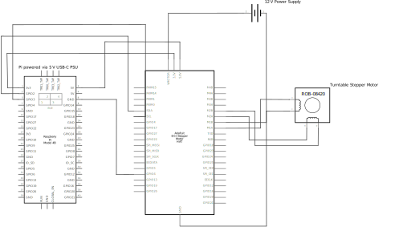

# PhotoPi: Automated 3D Plant Phenotyping System

**PhotoPi** is a Python-based system designed for automated 3D plant phenotyping. It integrates a multi-camera setup and a turntable controlled by a Raspberry Pi for systematic image acquisition. These images are then processed (optionally on a remote server using COLMAP) to reconstruct 3D point cloud models of plants, which can be further analyzed to extract quantitative phenotypic traits.

## Overview

PhotoPi streamlines the complex process of 3D plant model generation and analysis. It provides a cost-effective and automated alternative to manual phenotyping, enabling researchers to capture detailed structural data of plants for various studies in agriculture, botany, and plant breeding.

This document provides a high-level overview. For more detailed information on specific components, please see:

* **[Main System (Control & GUI) README](photopack/main_system/README.md)**
* **[Raspberry Pi System README](photopack/raspberry_pi/README.md)**
* **[Remote Server (3D Reconstruction) README](photopack/remote_server/README.md)**
* **[Point Cloud Analysis Toolkit README](photopack/point_cloud_analysis/README.md)**

## Core Features

* **Automated Image Capture:** GUI-driven control of cameras and turntable with enhanced error handling.
* **Distributed Processing:** Optional 3D reconstruction on a dedicated remote server with retry logic.
* **Modular Point Cloud Analysis:** Tools for extracting traits like height, volume, and leaf angles.
* **Configurable Setup:** Adaptable parameters with JSON schema validation.
* **Enhanced Security:** API key management and rate limiting for network operations.
* **Robust Networking:** Unified network module with connection pooling and automatic retries.
* **Comprehensive Testing:** Full test suite with pytest for reliability.

## System Architecture

PhotoPi comprises four main interacting parts:
1.  **Main System (Control PC):** User interface and overall workflow orchestration.
2.  **Raspberry Pi:** Hardware interface for cameras and turntable.
3.  **Remote Server:** (Optional) For computationally intensive 3D reconstruction.
4.  **Point Cloud Analysis Toolkit:** For extracting metrics from 3D models.

## Hardware Overview

A general list of required hardware includes:
* Control PC (Windows, macOS, or Linux)
* Raspberry Pi (e.g., Model 4B)
* Multi-camera setup (e.g., Arducam 64MP Quad-Camera Kit)
* Motorized Turntable & Stepper Motor HAT
* Featureless Background & Lighting
* (Optional) Remote Server for processing.


## Hardware List

The following table provides a breakdown of the main components and associated costs for the photogrammetry rig setup:

| **Part** | **Brand** | **Model** | **Price** | **Specs** | **Description** |
|----------|-----------|-----------|-----------|-----------|-----------------|
| Embedded system | Raspberry Pi | Raspberry Pi 4 Model B | $249.99 | Quad-core Cortex-A72, 4GB RAM, 40 pin GPIO header, 2-lane MIPI CSI camera port | Compact, low-cost computer board ideal for embedded applications |
| 4 RGB Cameras | Arducam | 64MP Autofocus Quad-Camera Kit | $199 | WiFi/Bluetooth, Res: 4056 x 3040 px, FOV diagonal: 84° | High-resolution, auto-focus RGB cameras for detailed image capture |
| Featureless Background | Rose Brand | 62" Poly Pro | $15.20 /yard | Fabric, Chroma Key Blue | Wrinkle-resistant fabric providing a uniform backdrop for imaging |
| Stepper Motor | Adafruit | Stepper Motor HAT - mini kit | $27.95 | TB6612 chipset, 4.5VDC to 13.5VDC, unipolar or bipolar | Motor HAT (Hardware Attached on Top) designed for precise motion control with the Raspberry Pi |
| Turntable | Ortery | PhotoCapture 360M | $1,200 | 28.956 and 39.878 cm diameter platforms | Software-controlled rotary table for consistent image capture angles |
| Aluminum Extrusion | Misumi | | $950 | Aluminum alloy, Square shape, 40mm main frame and arms size, four side slots | Frame with stationary mounts, angle brackets, nuts and screws |
| All-Purpose LED Grow Lights | Root Farm | | $145 each | 45W per panel, Grow area: 25 cm (10 in) x 55 cm (21.5 in) per panel, Adjustable legs with 360° swivel | Two growing light panels consisting of 3-band LEDs |

## Wiring Diagram

<p></p>
<p><em>Schematic of the modified wiring required to drive the the turntable stepper motor.</em></p>

## Software Prerequisites

* Python 3.8+
* COLMAP (for remote server reconstruction)
* Specific Python package dependencies (see `setup.py` and component READMEs)
* pytest (for running tests)

## Quick Start & Installation

1.  **Clone:** `git clone https://github.com/joehrz/PhotoPi.git && cd PhotoPi`
2.  **Environment:** `python -m venv venv && source venv/bin/activate` (or `venv\Scripts\activate` on Windows)
3.  **Install:** `pip install -e .[all]` (for all components)
    * For component-specific installation, see `setup.py` options and linked READMEs.
4.  **Raspberry Pi Setup:** Run `./deploy_to_pi.sh`.
5.  **Remote Server Setup:** Run `./deploy_to_remote_server.sh`.
6.  **Configuration:** Set up your `.env` file for credentials and review component-specific configurations (e.g., `params.json`, `config.yaml`).

## Project Structure & Modules

The project is primarily organized within the `photopack/` directory:
* **`photopack/main_system/`**: GUI and control logic for the main PC. ([Details](photopack/main_system/README.md))
* **`photopack/raspberry_pi/`**: Scripts for Raspberry Pi hardware control. ([Details](photopack/raspberry_pi/README.md))
* **`photopack/remote_server/`**: 3D reconstruction pipeline. ([Details](photopack/remote_server/README.md))
* **`photopack/point_cloud_analysis/`**: Tools for analyzing 3D models. ([Details](photopack/point_cloud_analysis/README.md))
* Top-level scripts like `deploy_to_pi.sh` and `deploy_to_remote_server.sh` assist with setup.

## Basic Usage Workflow

1.  **Launch GUI:** Start the Main System GUI (`photopack-main`).
2.  **Configure & Capture:** Set parameters and initiate image capture.
3.  **Reconstruct:** Transfer images to the remote server and run the `build.py` pipeline.
4.  **Analyze:** Use `photopack-analyze` tools on the generated point cloud.

*For detailed operational steps, consult the README file of the respective component linked above.*

## Testing

Run the comprehensive test suite:
```bash
python run_tests.py
```

Or use pytest directly:
```bash
pytest -v
```

## Configuration Overview

* **`.env` file (Project Root):** Essential for SSH credentials (Pi & Remote Server) and API keys.
* **`params.json` (Main System):** GUI settings, capture parameters with schema validation.
* **`config.yaml` (Remote Server):** COLMAP pipeline settings.
* **`scale_values.json` & `metrics_config.json` (Point Cloud Analysis):** Scaling factors and CSV output definitions.
* **Configuration Validation:** All JSON configurations are validated against schemas for reliability.

## Dataset

This work includes a dataset of 3D point clouds of wheat generated using the PhotoPi system:

**3D Point Clouds of Wheat from RGB-images using Structure from Motion and Low-Cost Photogrammetry**

* **Authors:** Beck, Michael A.; Hrzich, Joe; Bidinosti, Christopher P.; Henry, Christopher J.; Manawasinghe, Kalhari; Tanino, Karen
* **DOI:** [https://doi.org/10.20383/103.01255](https://doi.org/10.20383/103.01255)
* **Repository:** [FRDR-DFDR](https://www.frdr-dfdr.ca/repo/dataset/2e8d36ee-2183-4926-94d1-7323a702e309)
* **Description:** Contains raw RGB images and reconstructed point clouds of 6 different wheat genotypes at two time instances (14 and 35 days after planting), with 10 instances each, for a total of 120 imaging sessions. Each session includes 140 RGB images (4056x3040 pixels) and corresponding 3D point clouds.

## Citation

If you find our work useful, please cite our paper:

```bib
@article{hrzich2025lowcost,
  title={A Low-Cost Photogrammetry System for 3D Plant Modeling and Phenotyping},
  author={Hrzich, Joe and Beck, Michael A. and Bidinosti, Christopher P. and Henry, Christopher J. and Manawasinghe, Kalhari and Tanino, Karen},
  journal={arXiv preprint arXiv:2504.16840},
  year={2025},
  url={https://doi.org/10.48550/arXiv.2504.16840}
}

@dataset{beck2025wheat,
  title={3D Point Clouds of Wheat from RGB-images using Structure from Motion and Low-Cost Photogrammetry},
  author={Beck, Michael A. and Hrzich, Joe and Bidinosti, Christopher P. and Henry, Christopher J. and Manawasinghe, Kalhari and Tanino, Karen},
  year={2025},
  publisher={Federated Research Data Repository},
  doi={10.20383/103.01255},
  url={https://www.frdr-dfdr.ca/repo/dataset/2e8d36ee-2183-4926-94d1-7323a702e309}
}

